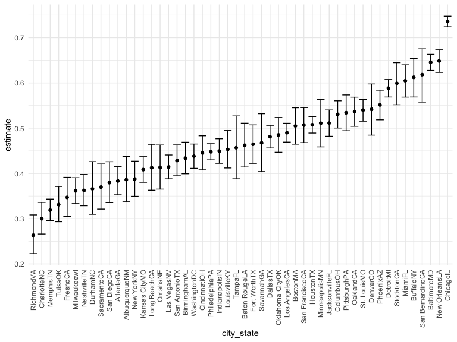
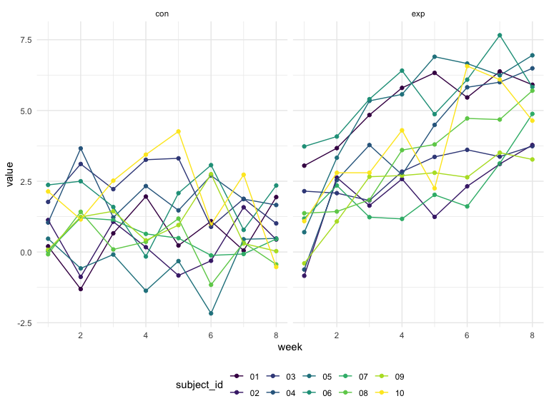

p8105\_hw5\_sl5009
================
Shengzhi Luo
19/11/2021

## Problem 1

``` r
homicide_df=
  read_csv("./data/homicide-data.csv",na=c("","Unknown")) %>% 
  mutate(
    city_state=str_c(city,state),
    resolution=case_when(
      disposition=="Closed without arrest" ~ "unsolved",
      disposition=="Open/No arrest" ~ "unsolved",
      disposition=="Closed by arrest" ~ "solved"
    )) %>% 
  relocate(city_state) %>% 
  filter(city_state!="TulsaAL")
```

Let’s focus on Baltimore,MD.

``` r
baltimore_df=
  homicide_df %>% 
  filter(city_state=="BaltimoreMD")
baltimore_summary=
  baltimore_df %>% 
  summarise(
    unsolved = sum(resolution=="unsolved"),
    n=n()
  )

baltimore_test=
  prop.test(
    x=baltimore_summary %>% pull(unsolved),
    n=baltimore_summary %>% pull(n)) 

baltimore_test %>% 
  broom::tidy() 
```

    ## # A tibble: 1 × 8
    ##   estimate statistic  p.value parameter conf.low conf.high method    alternative
    ##      <dbl>     <dbl>    <dbl>     <int>    <dbl>     <dbl> <chr>     <chr>      
    ## 1    0.646      239. 6.46e-54         1    0.628     0.663 1-sample… two.sided

Let’s try to iterate across cities!

First off, write a function and test it on a few sample cities.

``` r
prop_test_function=function(city_df){
  city_summary=
    city_df %>% 
    summarise(
     unsolved = sum(resolution=="unsolved"),
     n=n()
  )

 city_test=
   prop.test(
    x=city_summary %>% pull(unsolved),
    n=city_summary %>% pull(n)) 
 
 return(city_test)
}

prop_test_function(baltimore_df)
```

    ## 
    ##  1-sample proportions test with continuity correction
    ## 
    ## data:  city_summary %>% pull(unsolved) out of city_summary %>% pull(n), null probability 0.5
    ## X-squared = 239.01, df = 1, p-value < 2.2e-16
    ## alternative hypothesis: true p is not equal to 0.5
    ## 95 percent confidence interval:
    ##  0.6275625 0.6631599
    ## sample estimates:
    ##         p 
    ## 0.6455607

``` r
homicide_df %>% 
  filter(city_state=="AlbuquerqueNM") %>% 
  prop_test_function()
```

    ## 
    ##  1-sample proportions test with continuity correction
    ## 
    ## data:  city_summary %>% pull(unsolved) out of city_summary %>% pull(n), null probability 0.5
    ## X-squared = 19.114, df = 1, p-value = 1.232e-05
    ## alternative hypothesis: true p is not equal to 0.5
    ## 95 percent confidence interval:
    ##  0.3372604 0.4375766
    ## sample estimates:
    ##         p 
    ## 0.3862434

Let’s iterate across all cities.

``` r
results_df=
  homicide_df %>% 
  nest(data=uid:resolution) %>% 
  mutate(
    test_results=map(data,prop_test_function),
    tidy_results=map(test_results,broom::tidy)
  ) %>% 
  select(city_state,tidy_results) %>% 
  unnest(tidy_results) %>% 
  select(city_state,estimate,starts_with("conf"))
```

Try to make a plot showing estimates and confidence intervals.

``` r
results_df %>% 
  mutate(city_state=fct_reorder(city_state,estimate)) %>% 
  ggplot(aes(x=city_state,y=estimate))+
  geom_point()+
  geom_errorbar(aes(ymin=conf.low,ymax=conf.high))+
  theme(axis.text.x=element_text(angle=90,vjust = 0.5,hjust=1))
```



``` r
homicide_df %>% 
  group_by(city_state) %>% 
  summarise(
    unsolved=sum(resolution=="unsolved"),
    n=n()
  ) %>% 
  mutate(
    test_results=map2(unsolved,n,prop.test),
    tidy_results=map(test_results,broom::tidy)
  ) %>% 
  select(city_state,tidy_results) %>% 
  unnest(tidy_results) %>% 
  select(city_state,estimate,starts_with("conf"))
```

    ## # A tibble: 50 × 4
    ##    city_state    estimate conf.low conf.high
    ##    <chr>            <dbl>    <dbl>     <dbl>
    ##  1 AlbuquerqueNM    0.386    0.337     0.438
    ##  2 AtlantaGA        0.383    0.353     0.415
    ##  3 BaltimoreMD      0.646    0.628     0.663
    ##  4 Baton RougeLA    0.462    0.414     0.511
    ##  5 BirminghamAL     0.434    0.399     0.469
    ##  6 BostonMA         0.505    0.465     0.545
    ##  7 BuffaloNY        0.612    0.569     0.654
    ##  8 CharlotteNC      0.300    0.266     0.336
    ##  9 ChicagoIL        0.736    0.724     0.747
    ## 10 CincinnatiOH     0.445    0.408     0.483
    ## # … with 40 more rows

## Problem 2

Start with a dataframe containing all file names.

``` r
file_df=
  tibble(file=list.files(path="./data/zip_data")) 
longitu_df=
  file_df %>% 
 mutate(
    data=purrr::map(file,~read_csv(file.path("./data/zip_data",.)))
  )
longitu_df
```

    ## # A tibble: 20 × 2
    ##    file       data                 
    ##    <chr>      <list>               
    ##  1 con_01.csv <spec_tbl_df [1 × 8]>
    ##  2 con_02.csv <spec_tbl_df [1 × 8]>
    ##  3 con_03.csv <spec_tbl_df [1 × 8]>
    ##  4 con_04.csv <spec_tbl_df [1 × 8]>
    ##  5 con_05.csv <spec_tbl_df [1 × 8]>
    ##  6 con_06.csv <spec_tbl_df [1 × 8]>
    ##  7 con_07.csv <spec_tbl_df [1 × 8]>
    ##  8 con_08.csv <spec_tbl_df [1 × 8]>
    ##  9 con_09.csv <spec_tbl_df [1 × 8]>
    ## 10 con_10.csv <spec_tbl_df [1 × 8]>
    ## 11 exp_01.csv <spec_tbl_df [1 × 8]>
    ## 12 exp_02.csv <spec_tbl_df [1 × 8]>
    ## 13 exp_03.csv <spec_tbl_df [1 × 8]>
    ## 14 exp_04.csv <spec_tbl_df [1 × 8]>
    ## 15 exp_05.csv <spec_tbl_df [1 × 8]>
    ## 16 exp_06.csv <spec_tbl_df [1 × 8]>
    ## 17 exp_07.csv <spec_tbl_df [1 × 8]>
    ## 18 exp_08.csv <spec_tbl_df [1 × 8]>
    ## 19 exp_09.csv <spec_tbl_df [1 × 8]>
    ## 20 exp_10.csv <spec_tbl_df [1 × 8]>

Tidy the result

``` r
long_df=
  longitu_df %>% 
  mutate(
    control_arm=substr(file,1,3),
    subject_id=substr(file,5,6)
  ) %>% 
  relocate(control_arm,subject_id) %>% 
  select(-file) %>% 
  unnest(data) %>% 
  pivot_longer(
    week_1:week_8,
    names_to = "week",
    names_prefix = "week_",
    values_to = "value"
  ) %>% 
  mutate(
    week=as.numeric(week)
  )
long_df
```

    ## # A tibble: 160 × 4
    ##    control_arm subject_id  week value
    ##    <chr>       <chr>      <dbl> <dbl>
    ##  1 con         01             1  0.2 
    ##  2 con         01             2 -1.31
    ##  3 con         01             3  0.66
    ##  4 con         01             4  1.96
    ##  5 con         01             5  0.23
    ##  6 con         01             6  1.09
    ##  7 con         01             7  0.05
    ##  8 con         01             8  1.94
    ##  9 con         02             1  1.13
    ## 10 con         02             2 -0.88
    ## # … with 150 more rows

Make a spaghetti plot showing observations on each subject over time.

``` r
long_df %>% 
  ggplot(aes(x=week,y=value,color=subject_id))+
  geom_point()+
  geom_line()+
  facet_grid(.~control_arm)
```


As the plots above, the values of experimental arm group are generally
higher than control arm group. The values of the control arm group
change around the beginning point over time while the values in
experimental group increased over time.

## Problem 3

Download the dataset

``` r
library(tidyverse)
set.seed(10)
iris_with_missing = iris %>% 
  map_df(~replace(.x, sample(1:150, 20), NA)) %>%
  mutate(Species = as.character(Species))
```

Write a function

``` r
replace_function = function(vector){
    if(is.numeric(vector)){
      replace_value = mean(vector, na.rm=TRUE)
    }
  else if(is.character(vector)){
      replace_value = "virginica"
    }
  replace_na(vector,replace_value)
}
iris_df =
  iris_with_missing %>% 
  map_df(replace_function)
iris_df
```

    ## # A tibble: 150 × 5
    ##    Sepal.Length Sepal.Width Petal.Length Petal.Width Species
    ##           <dbl>       <dbl>        <dbl>       <dbl> <chr>  
    ##  1         5.1          3.5         1.4         0.2  setosa 
    ##  2         4.9          3           1.4         0.2  setosa 
    ##  3         4.7          3.2         1.3         0.2  setosa 
    ##  4         4.6          3.1         1.5         1.19 setosa 
    ##  5         5            3.6         1.4         0.2  setosa 
    ##  6         5.4          3.9         1.7         0.4  setosa 
    ##  7         5.82         3.4         1.4         0.3  setosa 
    ##  8         5            3.4         1.5         0.2  setosa 
    ##  9         4.4          2.9         1.4         0.2  setosa 
    ## 10         4.9          3.1         3.77        0.1  setosa 
    ## # … with 140 more rows
